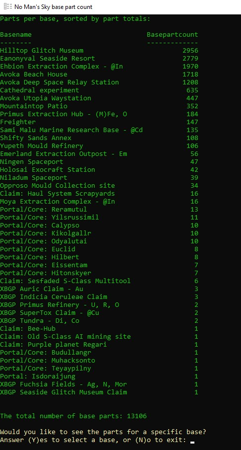
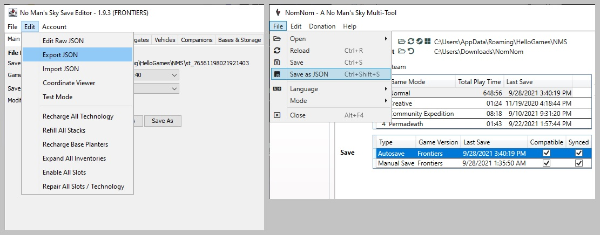

# NMS base part count
Counts all base parts in each of your No Man's Sky bases and freighter, and displays a listing of all entries in decreasing order of parts quantity.  It will also let you see a breakdown by part type for a particular base.

 

### Why the number of base parts matters
No Man's Sky has a hard limit of 16,000 total base parts across all bases (including your freighter) within one save file.  After reaching this limit, you're prevented from placing *any* additional parts within a base.

Further, it's often difficult to understand which bases have a high part count.  Save editors do divulge this information, but only one base at a time.  This is aimed at providing a top-down view of the spread of your base part counts to make decisions about how best to allocate this most precious resource.

For greater detail on what counts towards your totals and the technical details of verifying this limit, see this [breakdown](https://www.reddit.com/r/NoMansSkyTheGame/comments/jzmdnz/global_base_part_limit_analysis_what_actually/) on Reddit.

### How it works
This tool is composed of two simple parts:
1. A PowerShell script, which opens a file selection window to pick your exported save information, and then counts and sorts your bases according to part count.
2. A clickable shortcut, intended to reside on your desktop, but certainly locatable anywhere you choose.

Beginning with Frontiers, No Man's Sky implemented save file compression.  As the save file is no longer a simple JSON text file, the precursory step of exporting your save file as JSON by using a save editor is necessary.

### Instructions
To "install" it, if it can be called that, just download the ZIP file and open it.  Copy the `NoMansSkyPartCount.ps1` file to your Documents folder, and copy the `No Man's Sky base part count` shortcut to your Desktop (or wherever you want to keep it.)

Before running the tool, you'll need to create a JSON export of your No Man's Sky save.  To do this, use a No Man's Sky save editor app.  Both [NMS Save Editor](https://github.com/goatfungus/NMSSaveEditor) and [NomNom](https://github.com/cengelha/NomNom) are known to work.

Double-click the shortcut to run it.  A file selection window will open, which you then use to choose the JSON file you just exported.  The script will munch on the data, and display the sorted list.

### Download
* [GitHub](https://github.com/weasel-nms/NMS-base-part-count/releases/download/v1.0/NoMansSkyBasePartCountV1.0.zip) (NoMansSkyBasePartCountv1.0.zip)

### Contact
Feel free to contact me at the NMS Modding discord at https://discord.gg/5ercjgdy using `@weasel`.
